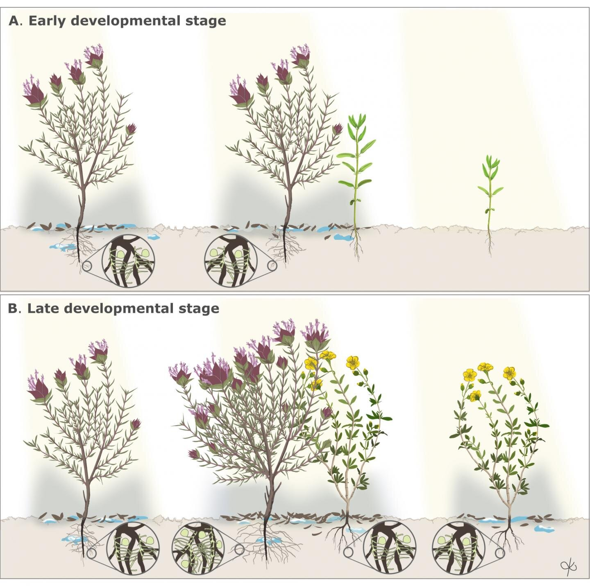

```{r setup, include=FALSE}
knitr::opts_chunk$set(echo = FALSE)
```

# Article



Scientific illustration created by Dr I M Berenjeno/DhramaBeren Studio, dharmaberen.com

## Source of the article 

[https://phys.org/news/2019-11-thought.html](https://phys.org/news/2019-11-thought.html)  
date : 13/11/19  
word count : 676

# Analysis of the article 

## Vocabulary

| Word from the text   | Synonym/definition   | French translation   |
|:--------------------:|:--------------------:|:--------------------:|
| long-held            | long established     | à long terme         |
| harsh              | unpleasantly rough  | rude |
| thrive    | grow healthily   | bien pousser   |
| lifespan    | period of existence  | durée de vie   | 
| to shelter   | to protect   | abriter   |
| seedling   | young plant  | semis  |
| gypsum   | sedimentary rocks   | gypse  |
| coastal  | littoral  | côtier  |
| barren   | not fertile  | incultivalble/stérile  |
| underneath  | below   | en dessous de  |
| on your own  | without company  | tout seul  |
| to shield   | to protect    | protéger  |
| win-win    | beneficial to both parties | gagnant-gagnant |
| to stack up   | to accumulate   | accumuler  | 
| moisture   | wetness   | humidité  |
| litter   | what organisms reject | déchets  |
| mammal | milk-feeding animal  | mammifère  |
| shingle   | stony beach  | graviers/galets   |
| to ensure   | to guarantee  | assurer/garantir  |

## Analysis table

|                                |                                  |
|:------------------------------:|----------------------------------|
| Researchers        | Dr. Rocio Pérez-Barrales at the University of Portsmouth and Dr. Alicia Montesinos-Navarro at Desertification Research Center in Valencia, Spain      |
| Published in ?  | 11/13/2019 in *Science Direct*   |
| General topic    | Scientists previously thought that plants were always in competition but in harsh soil mature plants help young plants to thrive    |
| Procedure     | Scientists study plants in their entire life and not at one moment particularly. They analyzed plants living in harsh environments and they saw that seedlings benefits from litter of the mature plants who make more flowers compared to plants on their own. Because of that, it has a huge good impact on biodiversity    |
| Conclusion/discovery    | A mature and established large plant called a nurse help a younger plant to grow healthily. Scientists called this processed *Facilitation*.It also helps to keep environments and ecosystems healthy |
| Remaining questions   | What are all the benefits of this relationships win-win ?  |
